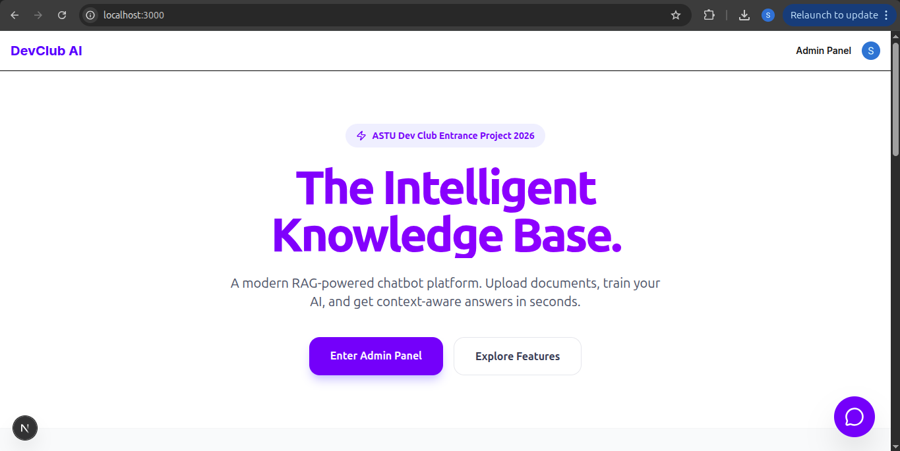
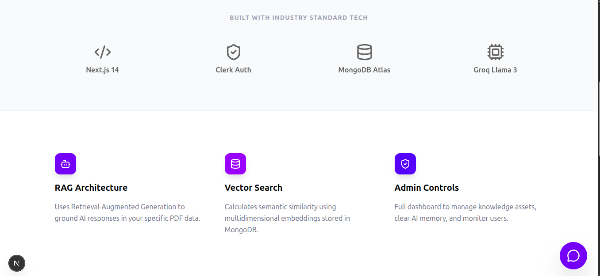
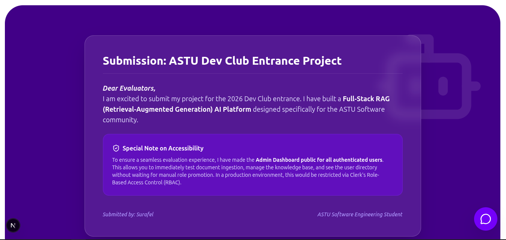
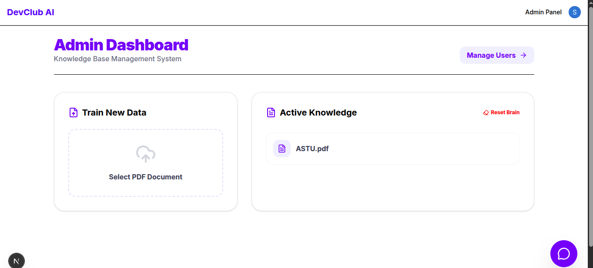
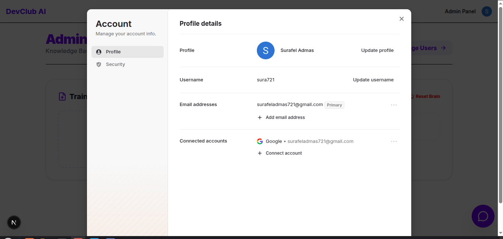

# ASTU Intelligent Knowledge Base (RAG-AI)

A **Retrieval-Augmented Generation (RAG) chatbot platform** for the ASTU Dev Club 2026 Entrance Project.

---

## 🚀 Features

- **RAG-based AI chatbot**
- **PDF upload → embedding → vector search**
- **Context-aware responses**
- **Persistent chat history** (MongoDB)
- **OAuth authentication** (Clerk)
- **Admin dashboard** for knowledge management

---

## 🛠️ Tech Stack

- **Next.js 15** (App Router)
- **MongoDB Atlas** (Vector Search – 768d, cosine)
- **Google Gemini** (Embeddings)
- **Groq – Llama 3.3 70B** (Inference)
- **Clerk** (Authentication)
- **Tailwind CSS**

---

## ⚡ Setup

1. **Clone & Install**
    ```bash
    git clone <repo-url>
    cd chatbot-csec-dev-club
    npm install
    ```

2. **Environment Variables**  
   Create a `.env.local` file:
    ```env
    NEXT_PUBLIC_CLERK_PUBLISHABLE_KEY=
    CLERK_SECRET_KEY=
    MONGODB_URI=
    GOOGLE_GENERATIVE_AI_API_KEY=
    GROQ_API_KEY=
    ```

3. **MongoDB Atlas Vector Index**
    - **Name:** `chatbot_index`
    - **Dimensions:** `768`
    - **Similarity:** `cosine`

4. **Run the App**
    ```bash
    npm run dev
    ```

---

## 👤 Author

**Surafel**  
Software Engineering Student –at ASTU and chess Lover


## Screenshots

### Landing Page


<br/><br/>

<br/><br/>


---

### Admin Dashboard



---

### Account Settings


